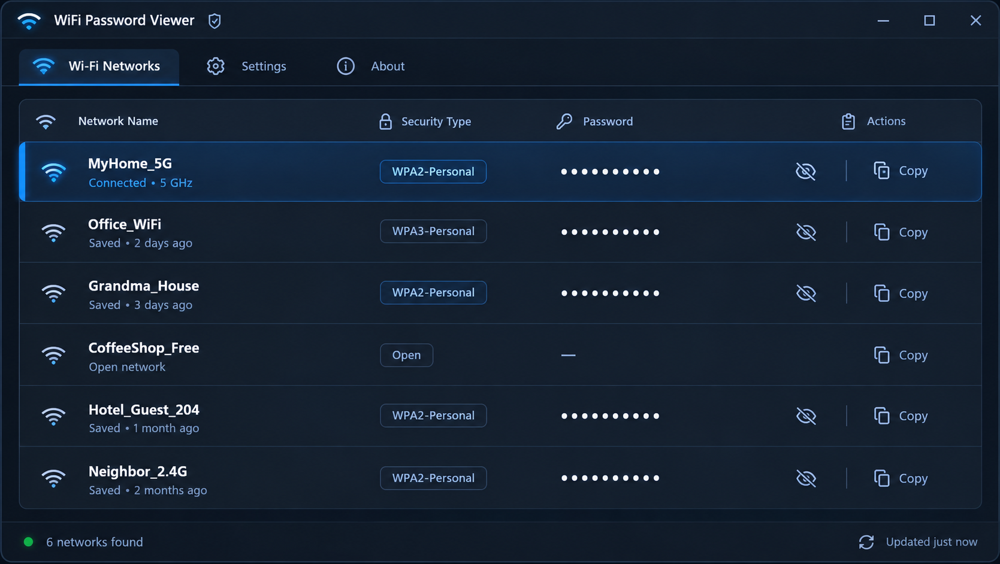

# WiFi Password Viewer

WiFi Password Viewer is a free, portable tool that shows all saved WiFi passwords on your Windows PC in one click. No installation, no ads, no internet connection required - it reads passwords directly from Windows and displays them in a simple, readable list.

## Screenshot

## Features

- View all saved WiFi network passwords on Windows in seconds
- Copy any password to clipboard with one click
- Works fully offline - no data ever leaves your PC
- Export saved WiFi passwords to CSV or TXT
- Portable .exe - no installation needed
- No ads, no telemetry, fully open source

## How to Install

1. Go to the [WiFi Password Viewer website](landing-page-url-here) and click **Download for Windows**
2. Your browser will download `WiFiPasswordViewer.zip` to your Downloads folder
3. Right-click the ZIP file and select **Extract All** (or use any unzip tool)
4. Open the extracted folder and double-click `WiFiPasswordViewer.exe` to run it — no installer, nothing to set up
5. If Windows shows a SmartScreen warning, click **More info** → **Run anyway** (this is normal for free, unsigned open-source apps)
6. If no networks appear in the list, right-click `WiFiPasswordViewer.exe` and choose **Run as administrator**

## How to View a Saved WiFi Password on Windows

WiFi Password Viewer reads network profiles that Windows already has stored on your PC. Once you open the app, it automatically lists every WiFi network your computer has connected to before, along with the saved password for each one. Click the eye icon next to any network to reveal its password, or use the Copy button to copy it straight to your clipboard.

This is useful when you need to:

- Reconnect an old device to a WiFi network you forgot the password for
- Share your home WiFi password with a guest without checking your router
- Move your saved networks to a new PC or laptop
- Recover a WiFi password after a router reset

## FAQ

### Is it safe to use?

Yes. WiFi Password Viewer only reads WiFi profiles that are already stored on your own PC by Windows. It does not connect to the internet, does not send any data anywhere, and the full source code is available in this repository for review.

### Does it require an internet connection?

No. The app works completely offline. It only reads local network profiles saved by Windows.

### Which Windows versions are supported?

WiFi Password Viewer works on Windows 10 and Windows 11 (both 32-bit and 64-bit).

### Why does the app show no networks?

Some Windows systems require administrator rights to read saved WiFi passwords. Try right-clicking the .exe and selecting "Run as administrator."

### Where does Windows store WiFi passwords?

Windows stores WiFi passwords in encrypted network profiles. WiFi Password Viewer decodes these profiles locally on your PC and displays the passwords in plain text for your convenience.

## Download

[Download Latest Version](download-url-here)

## License

MIT License - free for personal and commercial use.
